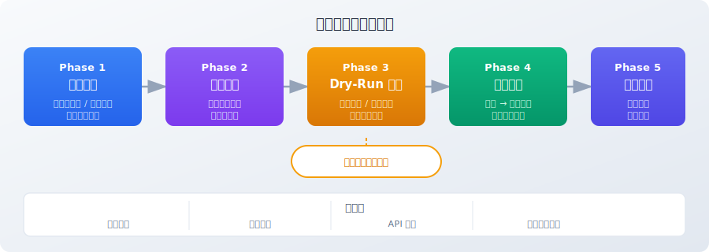
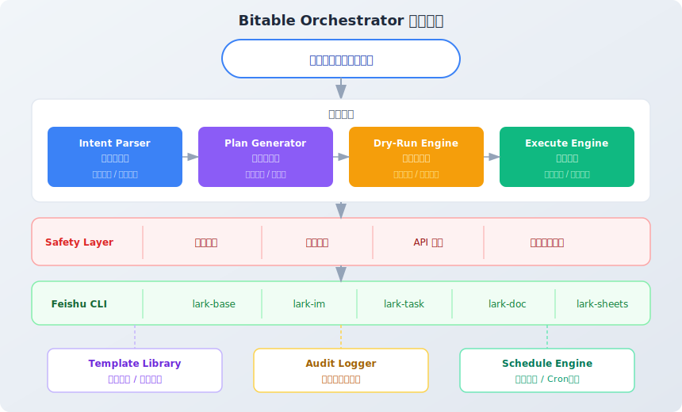

# Bitable Orchestrator 飞书多维表智能编排

> **核心价值**：用自然语言驱动飞书多维表的跨表级联操作——条件分支、批量处理、事务回滚，一句话搞定。
>
> **关键创新**：5阶段安全管线（意图解析→执行规划→Dry-Run预演→原子执行→审计学习），在修改数据之前你能看到每一步会发生什么。
>
> **技术栈**：Claude Code + 飞书 CLI (lark-base / lark-im / lark-task / lark-doc) | MIT License

---

> 用说话的方式，指挥飞书多维表干复杂的活。

飞书多维表的自动化，只会做一件事："当A发生时，做B。"一对一，一条线，一根筋。

但你真正想做的是这样的：

> "订单确认了，查一下库存够不够。够就扣掉，不够就通知采购补货。顺便每天下午给运营群发个汇总。"

一句话里有五件事：跨表查询、条件判断、数据修改、消息通知、定时任务。飞书原生自动化一个都做不了。

**Bitable Orchestrator 让你用自然语言驱动这一切——跨表关联、条件分支、批量处理、事务回滚，一句话搞定。**

---

## 为什么需要这个

先算一笔账。

| 业务场景 | 原生自动化 | Bitable Orchestrator |
|---------|-----------|---------------------|
| 订单确认→库存扣减→低库存告警→自动补货 | ❌ 无法跨表级联 | ✅ 一句话配置完整链路 |
| 金额分级审批（500/5000/50000三档） | ❌ 不支持条件分支 | ✅ 自动路由+通知 |
| 月底归档：汇总→生成报表→移动历史记录 | ❌ 需手动操作 | ✅ 定时自动执行 |
| 数据质量巡检：格式校验+去重+标记异常 | ❌ 无此能力 | ✅ 批量检测+智能标记 |
| 出错后恢复所有数据到操作前状态 | ❌ 不可能 | ✅ 快照+自动回滚 |

不是贵的问题。贵只是症状。病根是：它的架构从一开始就没打算让你处理真正的业务逻辑。

**核心价值**：把多维表从"记录数据的表格"升级为"可编程的业务引擎"。

---

## 这不是拍脑袋想出来的——真实用户在喊痛

以下痛点来自 Reddit（r/Airtable, r/Notion, r/nocode）和中文社区（V2EX, 知乎）的真实用户反馈。Airtable/Notion 与飞书多维表功能高度同构，痛点直接适用。

### 痛点1：自动化条数限制，花钱也解决不了

> *"I just hit the wall with automation limit with our production system. Make or Zapier is a road through hell."*
> — [r/Airtable](https://www.reddit.com/r/Airtable/comments/1rarip1/automation_limits_why/), 生产管理系统用户（排班/仓库/工资/快递全在表里）

> *"Going from $240/year to $8K+ just to get 50 more automations. I seriously don't understand."*
> — [r/Airtable](https://www.reddit.com/r/Airtable/comments/1ky3jou/ridiculous_limit_on_automation_blocks_us/), CRM用户, 10 upvotes, 26 comments

涨33倍，只为多50条自动化规则。这就像你开了一家小饭馆，电力公司说：炒菜可以，但每月只能开30次火。

**Bitable Orchestrator 用AI驱动操作，不受原生自动化条数限制。**

### 痛点2：出错了没有后悔药

> *"I totally screwed up integrating 2 bases. Is there a way to revert back? Or is the lost data just that, lost?"*
> — r/Airtable, 用户不小心覆盖了数千条关联数据（原帖已删除，内容被多个Airtable社区讨论转引）

3个月的客户数据，5个人录入，每天2小时，总共900个工时。一个误操作，归零。原生工具没有单条记录级别的撤销——因为这个痛点，市面上出现了一批专门做备份的第三方工具（ProBackup, On2Air）。别人的痛苦，成了生意。

**Bitable Orchestrator 每次操作前自动快照，失败自动回滚到操作前状态。**

### 痛点3：级联自动化被一刀切禁止

> *"After I spent the whole day making an automation that other automations require to be triggered, I searched it up and it says Notion intentionally has this limitation."*
> — [r/Notion](https://www.reddit.com/r/Notion/comments/1s9tpkk/just_found_out_chain_automations_are_not_possible/), 3 upvotes

花了一整天搭链式自动化（A触发B，B触发C），结果平台故意禁止了。为了防无限循环，一刀切全砍。就像怕顾客吃坏肚子，把厨房关了。

**Bitable Orchestrator 用依赖图+拓扑排序原生支持链式操作，同时内置循环保护。**

### 痛点4：零代码和写代码之间没有中间地带

> *"The solution for self-imposed limit is to take a tool marketed as no-code and write code. Airtable is losing its way."*
> — [r/Airtable 评论](https://www.reddit.com/r/Airtable/comments/1ky3jou/ridiculous_limit_on_automation_blocks_us/muv1axn/)

一个号称零代码的工具，解决限制的方法是写代码。

**自然语言就是中间地带。** 不用学代码，也不受零代码工具的限制。

### 痛点5：谁改了什么数据，无从得知

整个 no-code 数据库赛道的共同缺陷：没有变更审计追踪。

**Bitable Orchestrator 记录每次操作的完整审计链：谁/什么时候/对什么数据/做了什么变更。**

### 中文社区的声音

> "商业标准版每月仅200次自动化运行次数，工作流和自动化共用同一额度。5人团队第一周就用完了。"
> — 知乎、[V2EX t/1143342](https://www.v2ex.com/t/1143342)

> "审批流程是飞书多维表格目前比较薄弱的环节，但却是B端产品较常需要使用到的功能。"
> — [人人都是产品经理](https://www.woshipm.com/evaluating/6150755.html)

> "触发条件与执行操作为一对一关系，若有多对一的情况设置起来较为繁琐。"
> — [人人都是产品经理](https://www.woshipm.com/evaluating/5935411.html)

V2EX 上活跃讨论 NocoDB、Teable、NocoBase 等开源替代方案——当用户开始研究"怎么自己搭一个"的时候，说明他们对现有产品有多绝望。

---

## 五阶段安全执行管线

你说一句话，它做五步。每一步都可追溯，每一步都可回滚。

<p align="center">
  
</p>

| 阶段 | 做什么 | 成本 | 收益 |
|------|--------|------|------|
| **Phase 1 意图解析** | 读取表结构、数据采样、发现表间关联 | 几秒钟 | 省去你解释表结构的时间 |
| **Phase 2 执行计划** | 拆解原子操作、构建依赖图、可视化展示 | 你花1分钟看计划 | 不是黑箱，你知道它要做什么 |
| **Phase 3 Dry-Run** | 不动真数据，模拟执行、冲突检测、预测结果 | 多等几秒 | 动手前就知道后果 |
| **Phase 4 原子执行** | 快照 → 逐步执行 → 失败自动回滚 | 执行稍慢（要拍快照） | 不留半成品，不留烂数据 |
| **Phase 5 审计学习** | 记录操作日志、提取可复用模板 | 存储空间 | 出问题能查，同类操作复用 |

---

## 核心能力

- **跨表关联操作** — 自动发现表间关系（显式关联+隐式匹配），支持任意深度的级联更新
- **条件分支** — IF/ELSE逻辑、多级路由、异常处理分支
- **批量处理** — 智能分页，自动限流，千条记录级别的批量操作
- **事务保障** — 操作前快照，失败自动回滚到操作前状态
- **Dry-Run模式** — 不实际修改数据，先模拟执行并展示预测结果
- **审计追踪** — 每次操作记录：谁/什么时候/对什么数据/做了什么变更
- **模式学习** — 从历史操作中提取可复用模板，同类需求一键复用
- **定时编排** — 将规则设为定时任务（如每天9点检查到期合同并提醒）
- **歧义消解** — 主动询问模糊指令，不做假设

### 原子操作类型

| 操作 | 说明 | 可回滚 |
|------|------|--------|
| `QUERY` | 读取记录 | — |
| `CREATE` | 创建记录 | ✅ 删除已创建的 |
| `UPDATE` | 更新字段 | ✅ 从快照恢复 |
| `DELETE` | 删除记录 | ✅ 从快照重建 |
| `AGGREGATE` | 聚合计算 | — |
| `VALIDATE` | 断言校验 | — |
| `BRANCH` | 条件分支 | — |
| `LOOP` | 批量遍历 | ✅ 逐条回滚 |
| `NOTIFY` | 发送通知 | ❌ 不可撤回 |

---

## 使用场景

### 场景一：销售→库存→采购 联动

```
用户：订单确认了就扣库存，库存不够就自动建采购申请通知采购群。
```

以前运营每天手动核对三张表，现在一句话。编排器会：解析3张表的结构和关联 → 生成 QUERY → LOOP → VALIDATE → UPDATE → BRANCH → CREATE → NOTIFY 操作链 → Dry-Run预测哪些SKU会低于安全线 → 执行时逐条校验。

### 场景二：月度数据归档

```
用户：每月1号，把上月已关闭的工单按部门汇总写入月报表，原始记录移到历史表。
```

以前月初第一天最烦的活，现在设好定时自动跑。编排器会：AGGREGATE（按部门分组统计）→ CREATE（写入月报表）→ BATCH_MOVE（原始记录→历史表，分批执行）→ 设为每月1日 09:00 自动执行。

### 场景三：多级审批路由

```
用户：报销单按金额分流：<500自动通过，500-5000给经理，>5000给总监。
```

以前HR一条条看金额分发，现在全自动。编排器会：BRANCH三路条件分支 → 自动通过直接UPDATE → 需审批NOTIFY审批人+设pending → 双级审批串联通知+状态流转。

### 场景四：数据质量巡检

```
用户：手机号格式不对的、重复的、半年没联系的，找出来标记。
```

以前靠肉眼扫表格，现在批量秒级检测。编排器会：并行4项检测（格式/格式/唯一性/时间）→ 标记异常记录+汇总到质量报告表 → 输出统计结果。

---

## 技术架构

<p align="center">
  
</p>

### 架构分层

| 层级 | 组件 | 职责 |
|------|------|------|
| **用户层** | 自然语言输入 | 描述业务规则 |
| **核心引擎** | Intent Parser → Plan Generator → Dry-Run Engine → Execute Engine | 解析→规划→验证→执行 |
| **安全层** | 快照保护 / 原子回滚 / API限频 / 敏感字段脱敏 | 数据安全底线 |
| **CLI层** | lark-base / lark-im / lark-task / lark-doc / lark-sheets | 飞书能力调用 |
| **支撑模块** | Template Library / Audit Logger / Schedule Engine | 模板复用 / 操作审计 / 定时编排 |

### 安全设计

安全不是feature，是底线。以下规则来源于前面那些"数据没了回不去"的真实事故：

- DELETE操作强制二次确认
- 单次上限5000条，超过必须分批确认
- 敏感字段（密码/身份证/银行卡）不出现在日志中
- 失败自动回滚，不留半成品状态
- API调用自限频（100次/分钟）

---

## 与其他 Skill 组合

| 组合 | 效果 |
|------|------|
| + lark-minutes | 会议决策→自动创建多维表追踪记录 |
| + lark-whiteboard | 数据聚合后→生成可视化图表 |
| + lark-im | 操作结果→通知相关人员 |
| + schedule | 编排规则→定时自动执行 |
| + lark-drive | 文件上传→解析→写入多维表 |

---

## 快速开始

### 前置条件

- [飞书CLI](https://github.com/nicepkg/lark-cli) 已安装并完成授权
- Claude Code 已安装

### 安装

```bash
git clone https://github.com/Evan-miwillbe/bitable-orchestrator.git ~/.claude/skills/bitable-orchestrator
```

### 使用

在 Claude Code 中直接说人话：

```
/bitable-orchestrator

当"销售订单"表中新增状态为"已确认"的订单时，
自动从"库存表"扣减对应商品数量。
如果库存低于安全线，在"采购需求"表创建补货申请，
同时通知采购群。
```

Claude Code 会：
1. 自动读取相关表的结构和样本数据
2. 生成可视化的执行计划
3. 模拟执行（Dry-Run），展示预测结果
4. 等你确认后才真正执行
5. 记录完整审计日志

全程说人话。不写代码。不拖拽流程图。

---

## 设计哲学

1. **声明式 > 命令式** — 你描述目标，不描述步骤
2. **可预测 > 黑箱** — Dry-Run让你动手前就知道后果
3. **可撤销 > 不可逆** — 快照+回滚，永远有后悔药
4. **渐进信任** — 小操作直接执行，大操作需确认，高危操作二次确认
5. **透明审计** — 每次变更有据可查

---

## 适用对象

- **运营/业务人员** — 不写代码，用自然语言配置复杂业务规则
- **项目管理者** — 自动化项目数据的归档、汇总、报告
- **财务/HR** — 审批流程自动化、数据合规检查
- **IT管理员** — 数据迁移、质量巡检、系统间同步

---

## 参赛信息

本项目参加 [飞书CLI创作者大赛](https://bytedance.larkoffice.com/docx/HWgKdWfeSoDw36xu7EYctBrUnsg)（GitHub赛道）。

**解决的核心问题**：飞书多维表原生自动化能力不足以处理企业真实业务逻辑的复杂度——跨表级联、条件分支、事务一致性、批量处理这些需求在 Reddit 和中文社区被反复提及但从未被解决。

**技术亮点**：
- 五阶段安全管线（不是简单的API封装）
- Dry-Run预测执行（执行前可见结果）
- 快照+原子回滚（数据安全保障）
- 模式学习+模板库（越用越智能）
- 定时编排支持（设好规则，自动执行）

---

## License

MIT

---

## 致谢

本项目参加 [飞书 CLI 创作者大赛](https://bytedance.larkoffice.com/docx/HWgKdWfeSoDw36xu7EYctBrUnsg)，感谢飞书团队和 Way to AGI 社区。

Built with [Claude Code](https://claude.ai/claude-code) + [飞书 CLI](https://github.com/nicepkg/feishu-cli)
